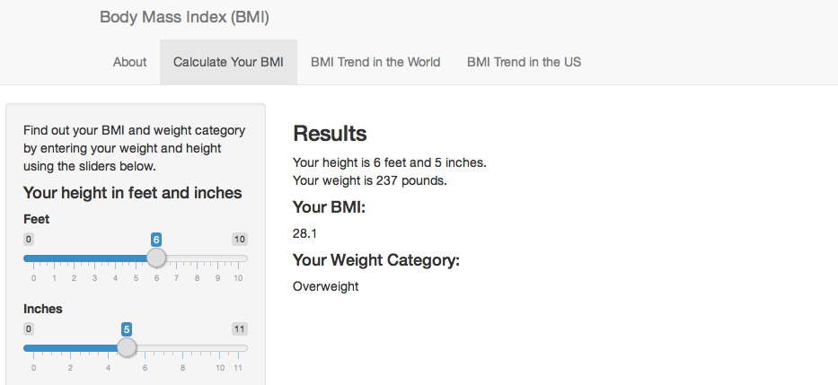
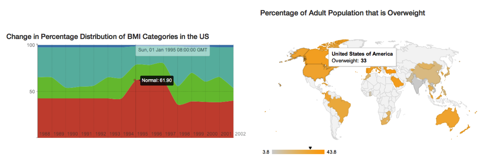

--- 
title       : Body Mass Index
subtitle    : An Educational Application
author      : Yuka Esashi
job         : Coursera John Hopkins University Data Science Specialization
framework   : deckjs        # {io2012, html5slides, shower, dzslides, ...}
highlighter : highlight.js  # {highlight.js, prettify, highlight}
hitheme     : solarized_light      # 
widgets     : [mathjax]            # {mathjax, quiz, bootstrap}
mode        : selfcontained # {standalone, draft}
knit        : slidify::knit2slides
--- 

## Body Mass Index: An Educational Application
### Coursera John Hopkins University Data Science Specialization: Developing Data Products
### Yuka Esashi

---

## What is BMI?

Body Mass Index (BMI) is a measure of a person's body fat based on height and weight. It is defined as:

$$\text{BMI}={\text{mass}_ \text{kg}\over\text{height}_ \text{m}^2}={\text{mass}_ \text{lb}\over\text{height}_\text{in}^2}\times 703$$

It can be used to place a person in one of the following weight categories:

$$\text{Underweight: BMI}<18.5$$
$$\text{Normal: } 18.5\leq\text{BMI}<25$$
$$\text{Overweight: } 25\leq\text{BMI}<30$$
$$\text{Obese: } 30<\text{BMI}$$

---

## Motivation for An Educational App

BMI for someone who is 160cm tall and weighs 65kg can easily be calculated with a simple R function, as shown below:

```{r}
bmi <- function(weight, height){
  weight/(height^2)
}
bmi(65,1.60)
```

But this is neither very informative nor engaging: the user can only compute their BMI. They don't right away know what their BMI category is, nor can they get any other additional information about BMI.

This is the motivation behind the educational application that has been built.

---

## What Does This App Do?

This application is intended to educate its users about the basics of BMI through interactive interface.
Users can:

1. Learn the basic definition of BMI
2. Calculate their own BMI by inputting their own height and weight, as well as find out which weight category they belong in
3. View interactive maps and charts to learn about global as well as American trend in BMI



---

## Features

1. Easy to use interface enabled by R package Shiny
2. Math equations clearly presented using MathJax
3. Interactive maps and charts enabled by GoogleVis and rCharts




